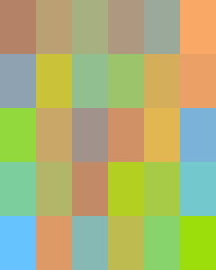

# HueHue 1.1

You can read about this game [in my blog](https://mathspp.com/blog/huehue).

## A game of colour

Your task is to turn this:

into

.

HueHue is a very simple game where you start with several tiles with different colours and the goal is to organize them in such a way that the colours create a soothing and harmonious degradee. Note that when the game starts the four corners are placed correctly.

You can drag around the tiles to move them.

The idea of this game is not ours but the implementation is a joint work by me and [@inesfmarques](https://github.com/inesfmarques).
